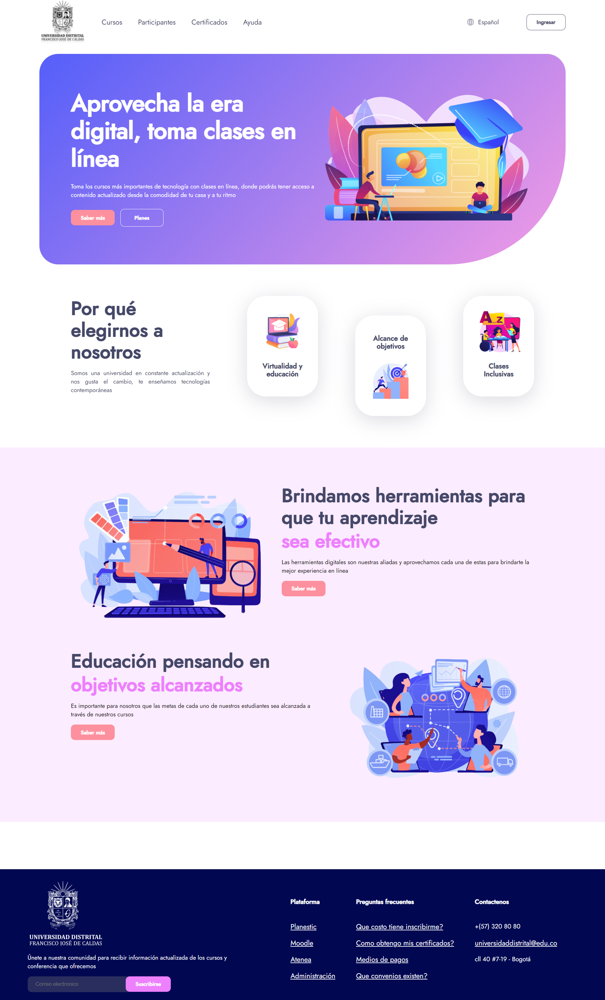

<h1>Taller 9: Mariana Alejandra Barbosa Mondragón</h1>

<h2>Informacion</h2>

Curso full stack basico: Grupo 1 

Profesor: Cristian Patiño 

<h2>Punto 1: Link de figma </h2>

<a href="https://www.figma.com/file/6uu0dekibx0epdZ8MSmipO/Mariana-Mondrag%C3%B3n---Figma-Exercise?type=design&node-id=0%3A1&mode=design&t=NBJ7Ob39ZWV1fvmn-1">Link de figma </a>

<h2>Punto 2 : HTML</h2>

<h2>Punto 3 = CSS</h2>

<h2>Punto 4 = titulos</h2>

<h2>Punto 5 = Parrafo</h2>

<h2>Punto 6 = links</h2>

<h2>Punto 7/8 = Menú</h2>

<h2>Punto 9 = Tabla</h2>
 

